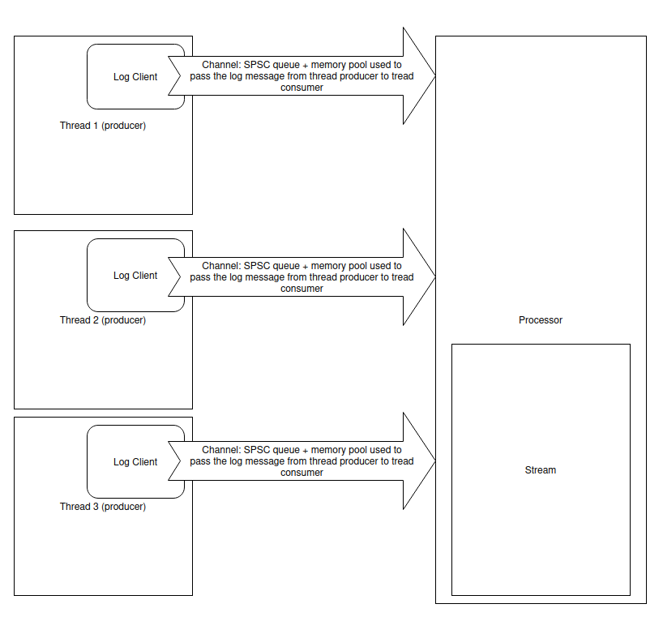

# Async logger from scratch

## Motivation

This project was created for learning and experiments purpose and by no mean created to use for prod environment.
If you need a proper logger, please use:

- [glog](https://github.com/google/glog)
- [spdlog](https://github.com/gabime/spdlog)
- ... any other logging framework that has big community

The project was inspired by the
talk: [Single Producer Single Consumer Lock-free FIFO From the Ground Up - Charles Frasch - CppCon 2023](https://www.youtube.com/watch?v=K3P_Lmq6pw0).
I want to create the similar guidance how to create the asynchronous logger from scratch and what needs to be
considered once you implement it.

## Why async?

For low latency applications it is crucial to have the minimal overhead of a logger. At the same time logging is crucial
for post event investigations.

All IO operations are slow by the definition, but we want to keep the "hot" path as fast as possible. As the result we
want to offload the writing part of the log to the thread that is not part of the critical path (part of application
core flow).

So we end up with the concept of the thread consumer of the logs and thread(s) producer(s). We also want to make sure
the consumer thread can be pined to the concrete CPU core so the scheduler will not "bother" our critical flow.

## High level architecture

Key actors:

1. Log client: thread local component responsible for the creating the log event and pushing to the channel
2. Channel: owned by the log client and represents a combination of the SPSC queue + memory pool
3. [SPSC queue](./RingBuffer.md): single producer-single consumer lock free wait free queue.
4. Thread pool: pool of memory that is used to create the log events. Main idea is to make sure we have memory
   allocation as fast as possible and avoid heap allocation
5. Processor: component responsible for consuming events from all channels. Processor will have a busy loop through all
   channels and check if event is in the queue. Once the event is in the queue proccessor will pull it from the queue
   and push to the stream component.
6. Stream: output stream where the logs should be sent. By default, the logger will just drop the logs. Library provides
   Stream to `std::cout`. Library can be extended to file, network or database.

Diagram of the components:



## A bit deeper dive in the data/log flow

Average log line [might look like this](https://google.github.io/glog/0.7.1/logging/#log-line-prefix-format):

```text
I1103 11:57:31.739339 24395 google.cc:2341] Command line: ./some_prog
I1103 11:57:31.739403 24395 google.cc:2342] Process id 24395
```

Each log line might have the following elements:

1. Log level
2. Time stamp
3. File name where the log was issued
4. Line in the file where the log was issued
5. Log message

Of course, none of the above elements is required to be presented, but most of the logger will provide them by default.

Also, a typical log interface would have something like this:

```cpp
#define LOG(level, msg, ...)
```

Here we see that as a user, we need to define the level of the log, message and arguments of the message.
So something like this could be our usage from the useer side:

```cpp
LOG(INFO, "Info log message with argument {}", 10);
```

Now once we know what the user will pass and what the final outcome should be we need to connect these 2 ends.

### Initiate the logger client

Client has the `thread_local` lifecycle. It means the object will be created whet the thread is created and the
destruction will happen once the thread exits.

During the creation, object will create the channel and allocate all memory it requires to function.

Client will also register the channel in producer, making sure the producer is aware about the new thread that was
created and the new channel of log events that should be monitored by the processor.

From code perspective, we have a log event:

```cpp
enum class Level : uint8_t {
    DEBUG = 0,
    INFO,
    WARN,
    ERROR,
    FATAL,
    Last,
};

struct Metadata {
    const Level level;
    const std::source_location location;
    const std::string_view fmt;
};

struct Event {
    const Metadata* meta;
    std::thread::id tid;
    timeval tv;
    const char* msg;
};
```

My main motivation to create the object of metadata is that pat of the information from the log event can be obtained at
compile time. And we do not need to request the information on each time we issue the log.
At the same time information like: thread ID, time stamp when the log was issued and arguments of the message can be
obtained ONLY at the runtime.

### Create the log event

Now knowing why the client has a thread local life cycle and how log event look like we can check the part of the code
where we create the log event.

```cpp
thread_local alog::Client client;

#define LOG(severity, format, ...)                                                            \
    do {                                                                                      \
        if constexpr (severity >= ALOG_LEVEL && severity < alog::Level::FATAL) {              \
            constexpr static alog::Metadata meta {                                            \
                .level = severity,                                                            \
                .location = std::source_location::current(),                                  \
                .fmt = format,                                                                \
            };                                                                                \
            client.log(&meta, ##__VA_ARGS__);                                                 \
        }                                                                                     \
        if constexpr (severity >= ALOG_LEVEL && severity == alog::Level::FATAL) {             \
            constexpr static alog::Metadata meta {                                            \
                .level = severity,                                                            \
                .location = std::source_location::current(),                                  \
                .fmt = format,                                                                \
            };                                                                                \
            auto st = alog::getStacktrace();                                                  \
            client.log(st, &meta, ##__VA_ARGS__);                                             \
        }                                                                                     \
    } while (0)
```

<b>NOTE:</b> We need to split FATAL and non-FATAL log as they have fundamental difference in behaviour and FATAL log
requires stacktrace.

Log level is defined at compile time, to minimise the runtime and avoid unnecessary checks. Metadata object has
compile time creation property. And we pass all needed information to the log client.

### Submit the log event to the queue

Once the client is requested to log the event, it will pass the data to the object Channel.

```cpp
template <class... Args>
void Client::log(const std::string& st, const Metadata* meta, Args... args)
{
    m_channel.send(st, meta, m_tid, args...);
}
```

The log creation happens in the Channel:

```cpp
template <typename... Args>
bool Channel::send(const Metadata* meta, const std::thread::id& id, Args&&... args)
{
    char* buffer = static_cast<char*>(m_pool.allocate());
    if (not buffer) {
        return false;
    }

    std::vformat_to(buffer, meta->fmt, std::make_format_args(args...));

    Event ev {
        .meta = meta,
        .tid = id,
        .tv = alog::timeInMicrosecond(),
        .msg = buffer,
    };

    return m_queue.tryPush(ev);
}
```

<b>Note:</b> We have to serialise the arguments in the producer thread. Based on the `format` library docs:
`std::format` does not affect the life cycle and it is responsibility of the developer to make sure arguments are still
valid once you construct the message.

### Consume event from the queue

On the another end of the queue we have a `Processor` who is in the busy loop iterates through all registered channels
and checks if any events available. Once the event appears in the queue, `Processor` will pull it and push to the
stream.

The `run()` function is called in the dedicated thread, that will be exclusively used by processor to pull events from
the queue.

```cpp
void Processor::run()
{
    if constexpr (0 <= ALOG_CPU_ID) {
        setCpuAffinity(ALOG_CPU_ID);
    }

    m_isRunning.store(true);

    Event ev;
    while (m_isRunning.load()) {
        std::lock_guard<mutex_t> guard(m_channelsLock);
        bool processed_events = false;
        for (auto* channel : m_channels) {
            if (channel && channel->recv(ev)) {
                // at least 1 event was processed
                processed_events = true;

                // check if the message was serialised or was directly copied from fmt
                auto msg = ev.msg != nullptr ? ev.msg : ev.meta->fmt;

                // push message into the output stream
                m_stream->log(ev.tv.tv_sec, ev.tv.tv_usec, ev.meta->level, ev.meta->location, ev.tid, msg.data());

                // free the memory
                channel->free(const_cast<char*>(ev.msg));
                ev.msg = nullptr;

                // stop the loop and any pending events processing
                if (ev.meta->level == Level::FATAL) {
                    m_isRunning = false;
                    break;
                }
            }
        }

        if (!processed_events) {
            // in case if all channels did not generate any logs, sleep
            std::this_thread::sleep_for(std::chrono::microseconds(100));
        }
    }

    if (ev.meta->level == Level::FATAL) {
        {
            std::lock_guard<mutex_t> guard(m_channelsLock);
            m_channels.clear();
        }

        // in case we stopped the loop on FATAL error
        std::exit(0);
    }
}
```

<b>Note:</b> special handling in case `Processor` receives the FATAL error message. In case of FATAL error, we terminate
the application.

### Stream the logs

Stream is an interface class, with single functionality, take the message and write them to the destination.
Based on the requirements, streamer can add:

1. Prefix formatting
2. Batch processing
3. Ordering the log events

Example of the base class for the log streamer:

```cpp
class StreamBase {
    static constexpr std::string_view timeFormat { "%Y%m%d-%H:%M:%S" };
    std::array<char, 32> timeBuffer {};

public:
    auto& getTimeBuffer() { return timeBuffer; }
    static auto getTimeFormat() { return timeFormat; }

    virtual void log(uint64_t tv_sec, uint64_t tv_usec, Level level, const std::source_location& sl, std::thread::id tid, const char* log)
    {
        // do nothing
    }
};
```

## Tradeoffs

### Where to format the log message

Currently, the overhead of the logger is:

1. Allocate buffer where to serialise the message
2. Serialise the message into the buffer
3. Read the timestamp
4. Construct the log event
5. Write log event to the queue

While the steps 3-5 will be hard to avoid, steps 1-2 can be still optimised. As of now I use `std::vformat_to` but it
requires to copy all arguments and the buffer and the format string. Potentially, we can serialise only arguments and
construct the log message in the processor thread. In this case we need to make sure the construction happens really
fast as processor should be fast enough to process all events.

### Global thread pool vs thread local

Having a channel per producer thread and for each channel a dedicated thread pool consumes a lot of memory. And most of
the memory will be unused. Reducing the queue capacity will result in reduction of the memory consumption but will put
more pressure on processor as in peak of log production processor will have to process logs fast enough to make sure we
have no logs lost.

### SPSC per client vs MPSC global queue

Communication channel should be lock free and wait free to make sure the hot path of the producer thread does not have
to wait to submit the log event. Wait free SPSC is way easier than Wait free MPSC. But if you know how to create a wait
free MPSC queue this would be a way better fit in the logger architecture.
