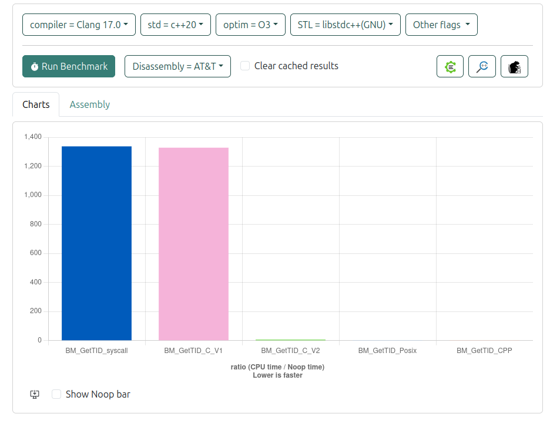
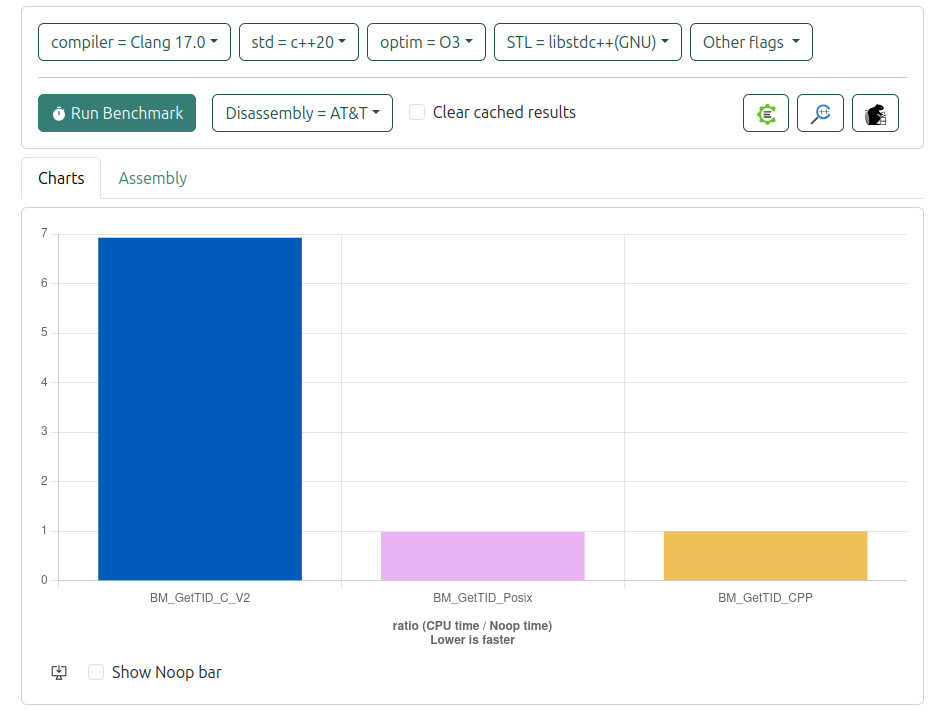

# TID

<b>TID = Thread ID</b>

Once you read the log, thread ID that issued the log is an important part of the log itself.
Usually it is one of the few instruments to investigate threads problems. so lets check how we can get
the thread ID at the runtime of the application.

# How to get TID at the runtime

In C or C++ there are few ways to get the TID.

## Syscall

In linux we have a system call: SYS_gettid

```cpp
inline __attribute__((always_inline)) auto get_tid_syscall() {
    return syscall(SYS_gettid);
}
```

## C-style gettid()

From the [official documentation](https://www.man7.org/linux/man-pages/man2/gettid.2.html):
```text
gettid() returns the caller's thread ID (TID).  In a single-
threaded process, the thread ID is equal to the process ID (PID,
as returned by getpid(2)).  In a multithreaded process, all
threads have the same PID, but each one has a unique TID.  For
further details, see the discussion of CLONE_THREAD in clone(2).
```

Code:

```cpp
inline __attribute__((always_inline)) auto get_tid_c_v1() {
    return gettid();
}
```

## C-style thrd_current()

Docs [C thrd_current()](https://en.cppreference.com/w/c/thread/thrd_current)

```cpp
inline __attribute__((always_inline)) auto get_tid_c_v2() {
    return thrd_current();
}
```

## C++-style std::this_thread::get_id()

In C++ we have get_id() from [std::thread](https://en.cppreference.com/w/cpp/thread/get_id)

Code:
```cpp
inline __attribute__((always_inline)) auto get_tid_cpp() {
    return std::this_thread::get_id();
}
```

## Posix thread
Docs: [posix](https://www.man7.org/linux/man-pages/man3/pthread_self.3.html)

Code:
```cpp
inline __attribute__((always_inline)) auto get_tid_posix() {
    return pthread_self();
}
```

# Performance

Let's use [benchmark](https://quick-bench.com/#) to measure performance of each approach.

Code:

```cpp
#include <benchmark/benchmark.h>

#include <thread>
#include <threads.h>
#include <pthread.h>
#include <syscall.h>
#include <unistd.h>
#include <iostream>

namespace alog {
inline __attribute__((always_inline)) auto get_tid_syscall() {
    return syscall(SYS_gettid);
}

inline __attribute__((always_inline)) auto get_tid_c_v1() {
    return gettid();
}

inline __attribute__((always_inline)) auto get_tid_c_v2() {
    return thrd_current();
}

inline __attribute__((always_inline)) auto get_tid_posix() {
    return pthread_self();
}

inline __attribute__((always_inline)) auto get_tid_cpp() {
    return std::this_thread::get_id();
}
} // ns alog


static void BM_GetTID_syscall(benchmark::State &state) {
    for (auto _: state) {
        auto tid = alog::get_tid_syscall();
        benchmark::DoNotOptimize(tid);
    }
}

static void BM_GetTID_C_V1(benchmark::State &state) {
    for (auto _: state) {
        auto tid = alog::get_tid_c_v1();
        benchmark::DoNotOptimize(tid);
    }
}

static void BM_GetTID_C_V2(benchmark::State &state) {
    for (auto _: state) {
        auto tid = alog::get_tid_c_v2();
        benchmark::DoNotOptimize(tid);
    }
}

static void BM_GetTID_Posix(benchmark::State &state) {
    for (auto _: state) {
        auto tid = alog::get_tid_posix();
        benchmark::DoNotOptimize(tid);
    }
}

static void BM_GetTID_CPP(benchmark::State &state) {
    for (auto _: state) {
        auto tid = alog::get_tid_cpp();
        benchmark::DoNotOptimize(tid);
    }
}

BENCHMARK(BM_GetTID_syscall);
BENCHMARK(BM_GetTID_C_V1);
BENCHMARK(BM_GetTID_C_V2);
BENCHMARK(BM_GetTID_Posix);
BENCHMARK(BM_GetTID_CPP);
```

Results:

Let`s run the benchmark and see the results:



Seems like `gettid` as a `syscal` or `function call` are very inefficient, and we should exclude it for now and check the comparison of other methods.



POSIX implementation should be the most performant, and we can stick to it, C++ under the hood uses posix as well so based on your preferences feel free the direct call of posix or C++.
What you need to keep in mind, C++ will be easy to migrate from Linux, but that means you need to re-test on another platform, as performance might be different.
