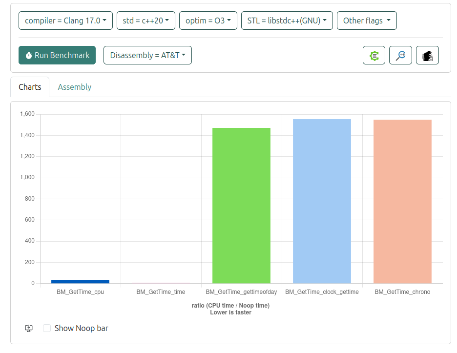
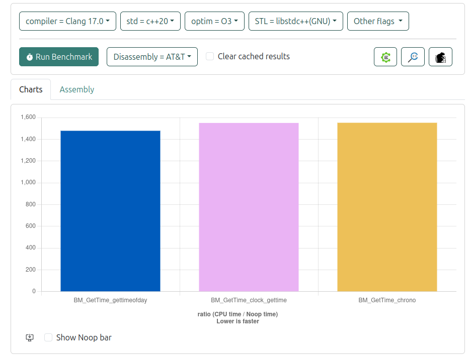

# Timer

## Clock

Following approaches available:

1. time()
2. clock_gettime(CLOCK_TYPE, ..)
3. gettimeofday()
4. std::chrono::<CLOCK_TYPE>::now()

## Clock types

### std::chrono clock

Reference: [cppreference chrono::clock](https://en.cppreference.com/w/cpp/chrono#Clocks)

#### std::chrono::system_clock

Reference: [cppreference std::chrono::system_clock](https://en.cppreference.com/w/cpp/chrono/system_clock)

    Class std::chrono::system_clock represents the system-wide real time wall clock.
    
    It may not be monotonic: on most systems, the system time can be adjusted at any moment. It is the only C++ clock
    that has the ability to map its time points to C-style time.
    
    The system_clock's time value can be internally adjusted at any time by the operating system, for example due to NTP
    synchronization or the user changing the system's clock. Daylight Saving Time and time zone changes, however, do not
    affect it since it is based on the UTC time-zone.

#### std::chrono::steady_clock

Reference: [cppreference std::chrono::steady_clock](https://en.cppreference.com/w/cpp/chrono/steady_clock)

    Class std::chrono::steady_clock represents a monotonic clock. The time points of this clock cannot decrease as physical
    time moves forward and the time between ticks of this clock is constant. This clock is not related to wall clock time
    (for example, it can be time since last reboot), and is most suitable for measuring intervals.

#### std::chrono::high_resolution_clock

Reference: [cppreference std::chrono::high_resolution_clock](https://en.cppreference.com/w/cpp/chrono/high_resolution_clock)

    Class std::chrono::high_resolution_clock represents the clock with the smallest tick period provided by the
    implementation. It may be an alias of std::chrono::system_clock or std::chrono::steady_clock, or a third,
    independent clock.
    
    There has been some controversy around the use of high_resolution_clock. Howard Hinnant, who claims to have introduced
    high_resolution_clock to the language, stated in 2016 on the ISO C++ Standard - Discussion mailing list that he was in
    favor of deprecating it. His rationale was that, because the standard allows for it to be an alias for
    std::chrono::steady_clock or std::chrono::system_clock, its use adds uncertainty to a program without benefit. However,
    other participants in the thread spoke out its favor, for instance on the basis that, because neither
    std::chrono::steady_clock nor std::chrono::system_clock come with any particular resolution guarantees,
    high_resolution_clock serves a useful role by giving the vendor an opportunity to supply the platform's
    highest-resolution clock, when neither its std::chrono::steady_clock nor its std::chrono::system_clock would be that.
    
    It is often just an alias for std::chrono::steady_clock or std::chrono::system_clock, but which one it is depends on
    the library or configuration. When it is a system_clock, it is not monotonic (e.g., the time can go backwards). For
    example, as of 2023, libstdc++ has it aliased to system_clock "until higher-than-nanosecond definitions become
    feasible", MSVC has it as steady_clock, and libc++ uses steady_clock when the C++ standard library implementation
    supports a monotonic clock and system_clock otherwise.

### glibc linux clock

Clock types are describes in [man clock_gettime()](https://www.man7.org/linux/man-pages/man3/clock_gettime.3.html)

    Sufficiently recent versions of glibc and the Linux kernel support
    the following clocks:

       CLOCK_REALTIME
              A settable system-wide clock that measures real (i.e., wall-
              clock) time.  Setting this clock requires appropriate privi‐
              leges.  This clock is affected by discontinuous jumps in the
              system time (e.g., if the system administrator manually
              changes the clock), and by the incremental adjustments per‐
              formed by adjtime(3) and NTP.

       CLOCK_REALTIME_ALARM (since Linux 3.0; Linux-specific)
              Like CLOCK_REALTIME, but not settable.  See timer_create(2)
              for further details.

       CLOCK_REALTIME_COARSE (since Linux 2.6.32; Linux-specific)
              A faster but less precise version of CLOCK_REALTIME.  This
              clock is not settable.  Use when you need very fast, but not
              fine-grained timestamps.  Requires per-architecture support,
              and probably also architecture support for this flag in the
              vdso(7).

       CLOCK_TAI (since Linux 3.10; Linux-specific)
              A nonsettable system-wide clock derived from wall-clock time
              but ignoring leap seconds.  This clock does not experience
              discontinuities and backwards jumps caused by NTP inserting
              leap seconds as CLOCK_REALTIME does.

              The acronym TAI refers to International Atomic Time.

       CLOCK_MONOTONIC
              A nonsettable system-wide clock that represents monotonic time
              since—as described by POSIX—"some unspecified point in the
              past".  On Linux, that point corresponds to the number of sec‐
              onds that the system has been running since it was booted.

              The CLOCK_MONOTONIC clock is not affected by discontinuous
              jumps in the system time (e.g., if the system administrator
              manually changes the clock), but is affected by the incremen‐
              tal adjustments performed by adjtime(3) and NTP.  This clock
              does not count time that the system is suspended.  All
              CLOCK_MONOTONIC variants guarantee that the time returned by
              consecutive calls will not go backwards, but successive calls
              may—depending on the architecture—return identical (not-
              increased) time values.

       CLOCK_MONOTONIC_COARSE (since Linux 2.6.32; Linux-specific)
              A faster but less precise version of CLOCK_MONOTONIC.  Use
              when you need very fast, but not fine-grained timestamps.
              Requires per-architecture support, and probably also architec‐
              ture support for this flag in the vdso(7).

       CLOCK_MONOTONIC_RAW (since Linux 2.6.28; Linux-specific)
              Similar to CLOCK_MONOTONIC, but provides access to a raw hard‐
              ware-based time that is not subject to NTP adjustments or the
              incremental adjustments performed by adjtime(3).  This clock
              does not count time that the system is suspended.

       CLOCK_BOOTTIME (since Linux 2.6.39; Linux-specific)
              A nonsettable system-wide clock that is identical to
              CLOCK_MONOTONIC, except that it also includes any time that
              the system is suspended.  This allows applications to get a
              suspend-aware monotonic clock without having to deal with the
              complications of CLOCK_REALTIME, which may have discontinu‐
              ities if the time is changed using settimeofday(2) or similar.

       CLOCK_BOOTTIME_ALARM (since Linux 3.0; Linux-specific)
              Like CLOCK_BOOTTIME.  See timer_create(2) for further details.

       CLOCK_PROCESS_CPUTIME_ID (since Linux 2.6.12)
              This is a clock that measures CPU time consumed by this
              process (i.e., CPU time consumed by all threads in the
              process).  On Linux, this clock is not settable.

       CLOCK_THREAD_CPUTIME_ID (since Linux 2.6.12)
              This is a clock that measures CPU time consumed by this
              thread.  On Linux, this clock is not settable.

    NOTES

        POSIX.1 specifies the following:

            Setting the value of the CLOCK_REALTIME clock via
            clock_settime() shall have no effect on threads that are
            blocked waiting for a relative time service based upon this
            clock, including the nanosleep() function; nor on the
            expiration of relative timers based upon this clock.
            Consequently, these time services shall expire when the
            requested relative interval elapses, independently of the new
            or old value of the clock.

        According to POSIX.1-2001, a process with "appropriate privileges"
        may set the CLOCK_PROCESS_CPUTIME_ID and CLOCK_THREAD_CPUTIME_ID
        clocks using clock_settime().  On Linux, these clocks are not
        settable (i.e., no process has "appropriate privileges").


    Historical note for SMP systems

        Before Linux added kernel support for CLOCK_PROCESS_CPUTIME_ID and
        CLOCK_THREAD_CPUTIME_ID, glibc implemented these clocks on many
        platforms using timer registers from the CPUs (TSC on i386, AR.ITC on
        Itanium).  These registers may differ between CPUs and as a
        consequence these clocks may return bogus results if a process is
        migrated to another CPU.

        If the CPUs in an SMP system have different clock sources, then there
        is no way to maintain a correlation between the timer registers since
        each CPU will run at a slightly different frequency.  If that is the
        case, then clock_getcpuclockid(0) will return ENOENT to signify this
        condition.  The two clocks will then be useful only if it can be
        ensured that a process stays on a certain CPU.
        
        The processors in an SMP system do not start all at exactly the same
        time and therefore the timer registers are typically running at an
        offset.  Some architectures include code that attempts to limit these
        offsets on bootup.  However, the code cannot guarantee to accurately
        tune the offsets.  Glibc contains no provisions to deal with these
        offsets (unlike the Linux Kernel).  Typically these offsets are small
        and therefore the effects may be negligible in most cases.
        
        Since glibc 2.4, the wrapper functions for the system calls described
        in this page avoid the abovementioned problems by employing the
        kernel implementation of CLOCK_PROCESS_CPUTIME_ID and
        CLOCK_THREAD_CPUTIME_ID, on systems that provide such an
        implementation (i.e., Linux 2.6.12 and later).

## time()

Source: [man time()](https://www.man7.org/linux/man-pages/man2/time.2.html)

The fastest way to get time in seconds resolution.

time() returns the time as the number of seconds since the Epoch,
`1970-01-01 00:00:00 +0000 (UTC)`.

## clock_gettime()

Source: [man clock_gettime()](https://www.man7.org/linux/man-pages/man3/clock_gettime.3.html)

The function clock_getres() finds the resolution (precision) of the
specified clock clockid, and, if res is non-NULL, stores it in the
struct timespec pointed to by res.  The resolution of clocks depends
on the implementation and cannot be configured by a particular
process.  If the time value pointed to by the argument tp of
clock_settime() is not a multiple of res, then it is truncated to a
multiple of res.

Used to monitor NANOSECOND resolution.

## gettimeofday()

Source [man gettimeofday()](https://www.man7.org/linux/man-pages/man2/gettimeofday.2.html)

The functions gettimeofday() and settimeofday() can get and set
the time as well as a timezone.

The tv argument is a struct timeval (as specified in
<sys/time.h>):

       struct timeval {
           time_t      tv_sec;     /* seconds */
           suseconds_t tv_usec;    /* microseconds */
       };

Used to monitor MICROSECOND resolution.


## std::chrono

Very powerful library with nanosecond resolution.

This is a default way to get the time point in C++ and convert to any format you need.

# Performance

we will use the [quick-bench](https://quick-bench.com) to measure the performance.

Code:
```cpp
#include <benchmark/benchmark.h>

#include <cstdint>
#include <sys/time.h>
#include <chrono>

namespace alog {
    inline __attribute__((always_inline)) uint64_t cpu_cycle_clock() {
        uint64_t low, high;
        __asm__ volatile("rdtsc" : "=a"(low), "=d"(high));
        return (high << 32) | low;
    }

    inline __attribute__((always_inline)) uint64_t alog_time() { return time(nullptr); }

    inline __attribute__((always_inline)) timeval alog_gettimeofday() {
        timeval tv{};
        gettimeofday(&tv, nullptr);

        return tv;
    }

    inline __attribute__((always_inline)) timespec alog_clock_gettime()
    {
        timespec timestamp{};
        clock_gettime(CLOCK_MONOTONIC, &timestamp);

        return timestamp;
    }

    inline __attribute__((always_inline)) auto alog_chrono()
    {
        return std::chrono::high_resolution_clock::now();
    }
} // ns alog


static void BM_GetTime_cpu(benchmark::State &state) {
    for (auto _: state) {
        auto ts = alog::cpu_cycle_clock();
        benchmark::DoNotOptimize(ts);
    }
}

static void BM_GetTime_time(benchmark::State &state) {
    for (auto _: state) {
        auto ts = alog::alog_time();
        benchmark::DoNotOptimize(ts);
    }
}

static void BM_GetTime_gettimeofday(benchmark::State &state) {
    for (auto _: state) {
        auto ts = alog::alog_gettimeofday();
        benchmark::DoNotOptimize(ts);
    }
}

static void BM_GetTime_clock_gettime(benchmark::State &state) {
    for (auto _: state) {
        auto ts = alog::alog_clock_gettime();
        benchmark::DoNotOptimize(ts);
    }
}


static void BM_GetTime_chrono(benchmark::State &state) {
    for (auto _: state) {
        auto ts = alog::alog_chrono();
        benchmark::DoNotOptimize(ts);
    }
}


BENCHMARK(BM_GetTime_cpu);
BENCHMARK(BM_GetTime_time);
BENCHMARK(BM_GetTime_gettimeofday);
BENCHMARK(BM_GetTime_clock_gettime);
BENCHMARK(BM_GetTime_chrono);
```


Results:
when we check the clock we see 2 different worlds: very slow and very fast. time() and cpu clock are very fast while when we try to get the clock via C-style calls or C++ std::chrono the runtime is very slow.



A closer look to the slow part:



A closer look to the fast part


# Conclusion

Seems like if we wat to use the clock for the purpose of the sorting events we can combile 2 fast methods.
If we need the clock to align multiple PCs, we need nanosec resolution and go via slow approach.

# Links

Useful links to get more about chrono library:

- [cppreference](https://en.cppreference.com/w/cpp/chrono)
- [blog post: chrono api](https://www.freecodecamp.org/news/cpp-std-chrono-api/)
- [blog post: The Three Clocks](https://www.modernescpp.com/index.php/the-three-clocks/)
- [blog post: C++20: Basic Chrono Terminology with Time Duration and Time Point](https://www.modernescpp.com/index.php/c20-basic-chrono-terminology-with-time-duration-and-time-point/)
