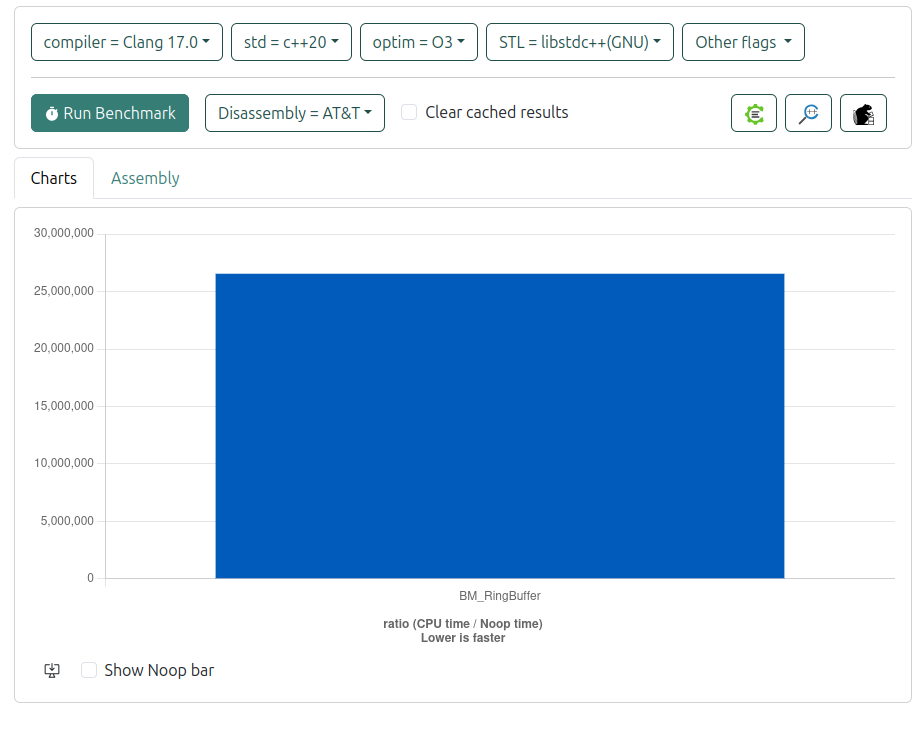

# Ring buffer - SPSC lock free and wait free queue

## TLDR;

We use the ring buffer that was explained during
the [CppCon 2023: Single Producer Single Consumer Lock-free FIFO From the Ground Up - Charles Frasch](https://www.youtube.com/watch?v=K3P_Lmq6pw0).

- [Slides](https://github.com/CppCon/CppCon2023/blob/main/Presentations/SPSC_Lock-free_Wait-Free_Fifo_from_the_Ground_Up_CppCon_2023.pdf)
- [Code](https://github.com/CharlesFrasch/cppcon2023/tree/main)

In this page we will not go in implementation details as I strongly doubt I can improve the qulity of presentation, so
if you are interested, just go and watch the talk!

## More info

If yo want to do a deeper dive, you can check the following pages:

- [DPDK Ring Library](https://doc.dpdk.org/guides/prog_guide/ring_lib.html)
- [1024 cores blog by Dmitry Vyukov](https://www.1024cores.net/home/lock-free-algorithms)
- [Optimizing a ring buffer for throughput by Erik Rigtorp](https://rigtorp.se/ringbuffer/)
- [Creating a Circular Buffer in C and C++ by Phillip Johnston](https://embeddedartistry.com/blog/2017/05/17/creating-a-circular-buffer-in-c-and-c/)

## Benchmarks

All bencquick-benchhmarks are executed in [quick-bench](https://quick-bench.com/)

Code we used for benchmarks (you can copy it and twick to see if the results are improved):

```cpp
#include <benchmark/benchmark.h>

#include <array>
#include <atomic>
#include <cassert>
#include <thread>
#include <iostream>

constexpr std::size_t cacheline = 64;

using padding = std::array<char, cacheline>;

namespace alog {

inline void setCpuAffinity(int cpu_id)
{
    cpu_set_t cpu_set;
    CPU_ZERO(&cpu_set);
    CPU_SET(cpu_id, &cpu_set);
    if (pthread_setaffinity_np(pthread_self(), sizeof(cpu_set_t), &cpu_set) != 0) {
        std::cerr << "Failed to set pthread_setaffinity_np for CPU ID: " << cpu_id << std::endl;
    }
}

template <class T, std::size_t S>
class RingBuffer {
private:
    static constexpr std::size_t m_idxMask = S - 1;
    std::array<T, S> m_buffer {};

    std::atomic_size_t m_pushIdx { 0 };
    [[maybe_unused]] padding m_padPush {};

    std::atomic_size_t m_popIdx { 0 };
    [[maybe_unused]] padding m_padPop {};

public:
    RingBuffer()
    {
        // make sure capacity is n**2
        assert((S > 1) && ((S & (S - 1)) == 0));
    }

    [[nodiscard]] bool empty() const
    {
        auto popIdx = m_popIdx.load();
        auto pushIdx = m_pushIdx.load();

        return popIdx == pushIdx;
    }

    bool tryPush(const T& v)
    {
        auto popIdx = m_popIdx.load();
        auto pushIdx = m_pushIdx.load();

        // is full
        if (auto currLen = pushIdx - popIdx; S == currLen) {
            return false;
        }

        m_buffer[pushIdx & m_idxMask] = v;
        m_pushIdx.store(pushIdx + 1);

        return true;
    }

    bool tryPop(T& v)
    {
        auto popIdx = m_popIdx.load();
        auto pushIdx = m_pushIdx.load();

        if (popIdx == pushIdx) {
            return false;
        }

        v = m_buffer[popIdx & m_idxMask];
        m_popIdx.store(popIdx + 1);

        return true;
    }
};
} // namespace alog

constexpr auto cpu1 = 1;
constexpr auto cpu2 = 2;

static void BM_RingBuffer(benchmark::State& state)
{
    alog::RingBuffer<int, 1024> buffer;

    auto consumer = std::jthread(
        [&buffer]() {
            alog::setCpuAffinity(cpu1);

            int val;
            while (true) {
                while (not buffer.tryPop(val)) {
                    // loop until the value is pulled!
                }
                benchmark::DoNotOptimize(val);

                if (val == -1) {
                    // once the queue has -1 -> break;
                    break;
                }
            }
        });

    // give some time to start the consumer thread
    std::this_thread::sleep_for(std::chrono::milliseconds(100));

    // current thread is a producer
    alog::setCpuAffinity(cpu2);

    int val = 0;
    for (auto _ : state) {
        while (auto again = not buffer.tryPush(val)) {
            benchmark::DoNotOptimize(again);
        }
        ++val;

        // wait till consumer cleans the queue
        while (auto again = not buffer.empty()) {
            benchmark::DoNotOptimize(again);
        }
    }
    int iterations = val;

    val = -1;
    while (not buffer.tryPush(val)) {
    }

    ++iterations;
    state.counters["ops/sec"] = benchmark::Counter(double(iterations), benchmark::Counter::kIsRate);
}

BENCHMARK(BM_RingBuffer);

```

Results:



## Conclusion

ringbuffer could be one of the first place to change if you want to improve the logging performance.
Another place would be log argument serialisation.
